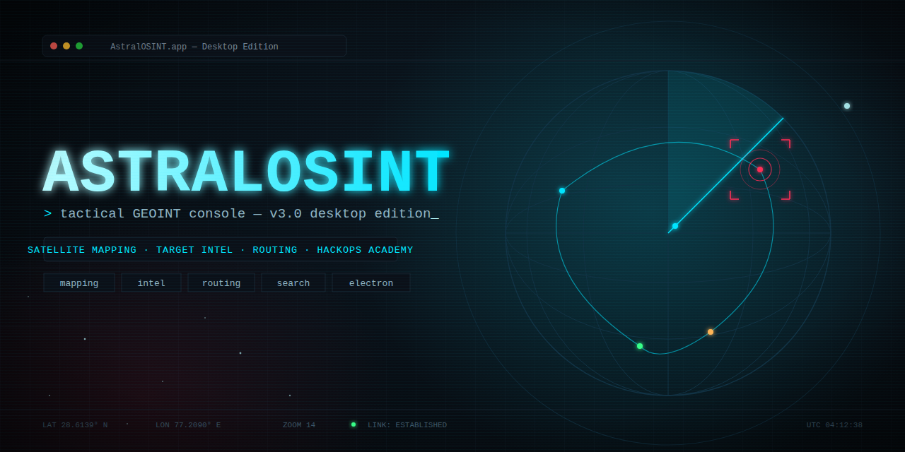

<p align="center">
  
</p>

# 🛰️ AstralOSINT | Tactical GEOINT Console


-38bdf8.svg)

**AstralOSINT** is a professional-grade Geospatial Intelligence (GEOINT)
console built for OSINT researchers, pentesters, and security analysts.
It provides a single tactical interface for satellite imagery analysis,
target/point-of-interest tracking, and route planning.

Developed by **HackOps Academy**.

**📖 Learn AstralOSINT like a professional:** the full course is live at
**[hackops-academy.github.io/astralosint](https://hackops-academy.github.io/astralosint/)**
— 13 modules covering the HUD, map layers, target designation, tagging,
routing, export/import, and a full tactical research methodology.

---

<p align="center">
  
</p>

## ⚡ What's new in v3.0 (Desktop Edition)

v3.0 moves AstralOSINT off `localhost:8080` and into a proper desktop app,
using the same Electron shell pattern as [Glacier](https://github.com/hackops-academy)
and [MetaGhost](https://github.com/hackops-academy) — HackOps Academy's
other tools.

- **Real desktop app** — a native window, a taskbar entry, an Applications
  menu shortcut. No more opening a terminal and a browser tab every time.
- **Native file dialogs** — Export/Import now use your OS's actual save
  and open dialogs instead of a silent download-to-`~/Downloads` and a
  hidden file picker.
- **Installable** — `./packaging/install.sh` sets it up as a first-class
  app under `~/.local/share/astralosint` with a menu entry and icon, just
  like MetaGhost.
- The original browser-based launcher, `run.sh`, is kept for a quick
  no-install preview or headless use — the exact same HUD, tabs, map
  engine, and intel log, just served over `localhost:8080` in a browser
  tab instead of a native window.
- Tactical HUD look and feel — the dark console, radar sweep, scanlines,
  and cyan signal colors — is unchanged. This release is about the shell
  it runs in, not a redesign.

---

## 🖥️ Key Features

### 🖥️ Tactical HUD Interface
* Live top status bar — UTC clock, cursor lat/lng, zoom level, connection status.
* Tabbed **Mission Console** (Search / Layers / Intel / Route) instead of a single scrolling menu.
* Ambient scanline, vignette, and radar-sweep overlay for a console feel — respects `prefers-reduced-motion`.
* Toast notification system for feedback (no jarring `alert()` popups).

### 🌍 Multimodal Mapping
* **Street**, **Satellite**, **Terrain**, and **Tactical (dark)** tile layers, switchable in one click.
* Optional marker clustering toggle for dense target sets.

### 📍 Intel Management
* Click anywhere on the map to designate a target — instant reverse geocoding for a real-world address.
* **Tagged targets**: WiFi, CCTV, Entry, Vehicle, Person, or Custom — each with its own icon on the map and in the list.
* Per-target notes, one-click delete, and a persistent bottom-left coordinate readout with copy-to-clipboard.
* **Export / Import** the full intel log as JSON, through native save/open dialogs.
* Locate-me (device geolocation) support.

### 🗺️ Tactical Routing
* Plot a road route between any two logged targets with live distance/time estimates.
* Automatic dashed line-of-sight fallback when road data is unavailable.

### 🔍 Advanced Search
* Global place/address search with a result list (not just "jump to first match").
* `Ctrl`/`Cmd` + `K` to jump into search from anywhere, `Esc` to close the console.

---

## 🛠️ Tech Stack

| Component | Technology |
| :--- | :--- |
| **Shell** | Electron (native window, native dialogs) |
| **Mapping Engine** | [Leaflet.js](https://leafletjs.com/) |
| **Clustering** | Leaflet.markercluster |
| **Routing** | Leaflet Routing Machine + OSRM |
| **Geocoding / Search** | OpenStreetMap Nominatim |
| **UI/UX** | Custom CSS3 (design tokens) + vanilla JS, Rajdhani / Share Tech Mono type |

No frameworks, no build step, no tracking — the map/search/routing side
still talks only to the public OSM/OSRM APIs; internet access is required
for map tiles, search, reverse geocoding, and road routing.

---

## 🚀 Installation & Usage (Desktop App)

Requires Node.js/npm.

```bash
git clone https://github.com/hackops-academy/AstralOSINT.git
cd AstralOSINT

./setup.sh   # one-time: installs Electron deps
./start.sh   # launches the AstralOSINT window
```

### Install as a desktop app (Kali / Debian-based)

Prefer a proper Applications-menu entry and an `astralosint` terminal
command over running it from the cloned repo each time?

```bash
./packaging/install.sh     # installs to ~/.local/share/astralosint, adds
                            # a menu entry, an icon, and an `astralosint` command
astralosint                # launch it from anywhere

./packaging/uninstall.sh   # removes everything the installer created
```

See `packaging/README.md` for exactly what gets installed where.

### Basic workflow
- Click the map to designate a target → the **Intel** tab fills in coordinates and address automatically.
- Name it, pick a tag, hit **Save Target** → it's logged to the map and the sidebar list.
- Use **Route** to plot a path between two logged targets, or **Export** to save your intel log as JSON via the native save dialog.

---

## 🌐 Browser fallback (no install)

Don't want to install Node/Electron? The original browser-based launcher
still works:

```bash
chmod +x run.sh
./run.sh
```

Choose option `1) Start Local Server`. It starts a Python HTTP server on
port 8080 and opens `http://localhost:8080` in your default browser.
Export/Import fall back to a normal browser download and file picker in
this mode.

---

## 📂 Project Structure

```text
AstralOSINT/
├── run.sh                  # browser fallback launcher (localhost:8080)
├── setup.sh                 # one-time Electron dependency install
├── start.sh                  # launches the desktop app
├── hud/
│   ├── main.js                # Electron main process (native dialogs)
│   ├── preload.js              # context-isolated bridge to the renderer
│   ├── index.html               # the console UI (same HUD as before)
│   ├── css/style.css
│   ├── js/
│   │   ├── map.js                 # Leaflet engine, intel storage, routing
│   │   └── ui.js                   # Console tabs, HUD, toasts, interactions
│   └── logo.svg
├── assets/                  # logo, banner
├── packaging/                 # desktop install/uninstall
│   ├── install.sh
│   ├── uninstall.sh
│   ├── bin/astralosint          # installed launcher command
│   └── astralosint.desktop       # menu entry template
└── screenshots/               # README preview images
```

## 🤝 Contributing
Contributions are welcome! If you have ideas for new layers (Thermal, Weather, etc.), new target tag types, or better data export formats:
1. Fork the project
2. Create your feature branch (`git checkout -b feature/AmazingFeature`)
3. Commit your changes (`git commit -m 'Add some AmazingFeature'`)
4. Push to the branch (`git push origin feature/AmazingFeature`)
5. Open a Pull Request

## 📖 Learn more

- **[Full course — hackops-academy.github.io/AstralOSINT](https://hackops-academy.github.io/AstralOSINT/)**
  — a 13-module walkthrough on operating AstralOSINT like a professional, from
  first launch through a complete tactical research methodology.

## ⚖️ Disclaimer
This tool is intended for Open Source Intelligence (OSINT) research and educational purposes. Always respect privacy laws and the Terms of Service of the map data providers.

<p align="center">
Developed with ❤️ by HackOps Academy
</p>
